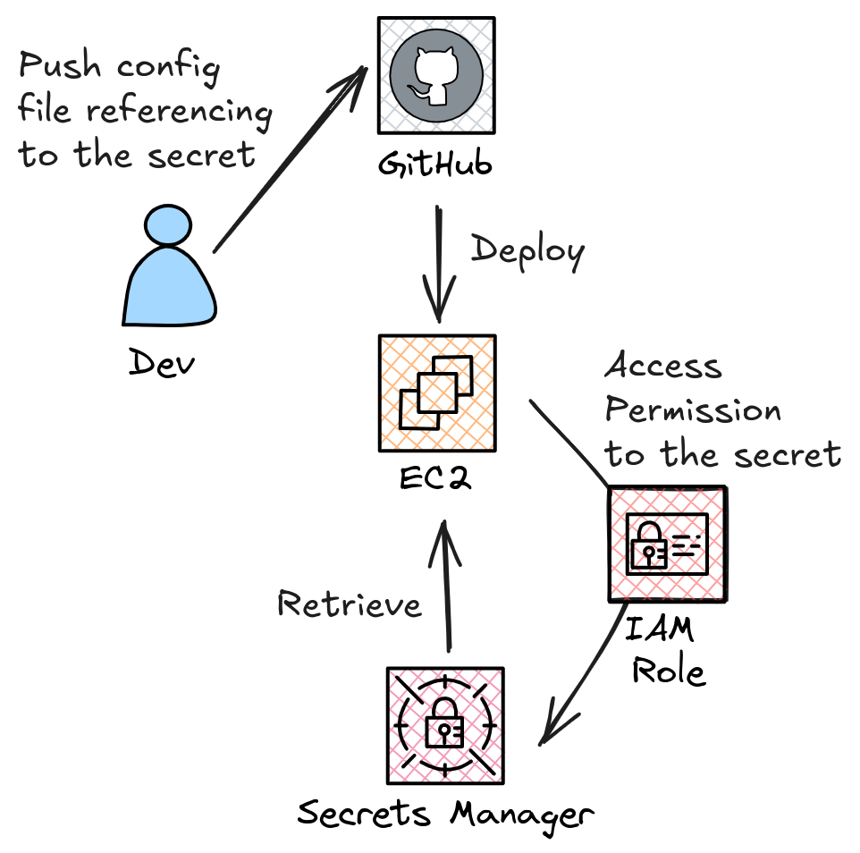

# OmegaConf Plugin - Cloud Resolvers

This package is a plugin designed to enhance OmegaConf by providing additional custom resolvers to **securely retrieve
sensitive values** that should not be hard-coded in your configuration files.

## Abstract

Having code in production is always challenging, and reports like the one provided by
[Unit42 from Palo Alto Networks](https://unit42.paloaltonetworks.com/large-scale-cloud-extortion-operation/)
are proof of them. 

This plugin is an attempt to mitigate this problem, letting you move your secrets from any file (like an `.env`)
to a more secure place, so they are retrieved only when needed.

The following diagram depicts the main idea in an AWS environment:

    

It is built on top of OmegaConf, hence it can be also used together with [Hydra](https://hydra.cc/). 
To check out the examples using Hydra, go to [Integration with Hydra](./users-guide/integration-hydra.md)

Currently, the following cloud services are supported: 
 
 * AWS Secrets Manager
 * AWS Parameter Store
 * GCP Secret Manager

# Collaborate